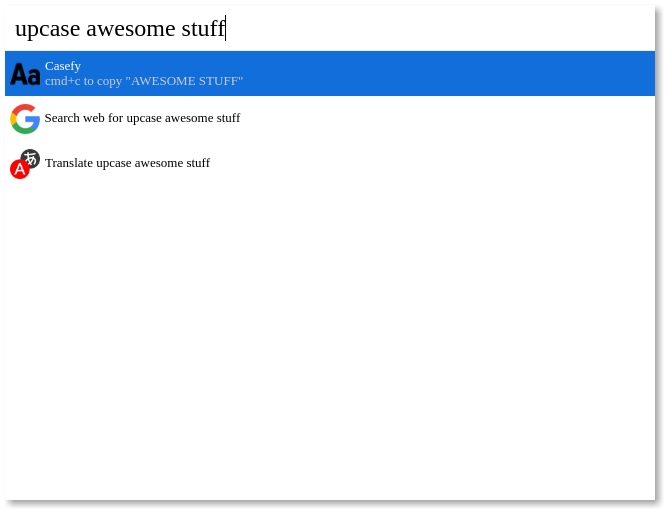

# Cerebro Text Casing

> UpperCase or LowerCase your texts easily.

## Usage

In Cerebro, type either `upcase` or `lowcase` then your text.

Use <kdb>cmd+c</kbd> to copy the result text.

## Related

* [Cerebro](http://github.com/KELiON/cerebro) – main repo for Cerebro app;
* [Icon](icon.png) made by [Zurb](http://www.flaticon.com/authors/zurb) from http://www.flaticon.com is licensed by [CC 3.0 BY](http://creativecommons.org/licenses/by/3.0/).

## License

MIT © [Lubien](http://lubien.me)
